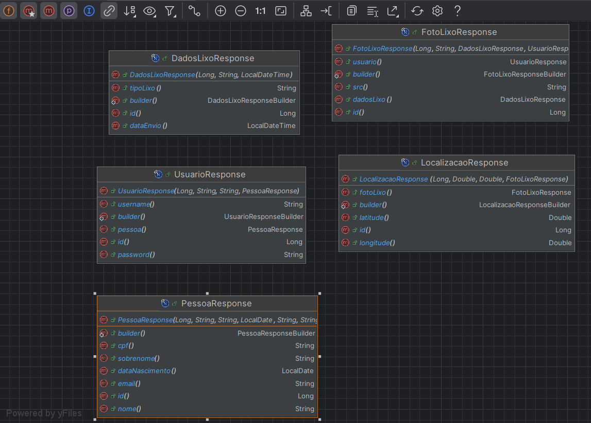

# Teach Peach: Combatendo a Poluição Costeira e Marinha com Conscientização


**Teach Peach** é uma plataforma que visa combater a poluição costeira e marinha, capacitando cidadãos a se tornarem agentes de mudança. Através do monitoramento colaborativo e da conscientização pública, o projeto busca proteger e preservar o meio ambiente para as futuras gerações.

## Integrantes

* **Allesson Augusto (RM99533):** Compliance & Quality Assurance
* **Cauã Mongs (RM552178):** Advanced Business Development with .NET
* **Erik Teixeira (RM551377):** Disruptive Architectures: IOT, IOB & Generative IA e Java Advanced
* **Guilherme Naoki (RM551456):** Mastering Relational and Non-Relational Database
* **Leonardo Gonçalves (RM98912):** DevOps Tools e Cloud Computing

**Contribuições em Equipe:**
* Mobile App Development: Todo o grupo colaborou.


## Rodando a Aplicação

**Pré-requisitos:**

* Java JDK 8 ou superior
* Maven
* Banco de dados (ex: MySQL, PostgreSQL)

**Passos:**

1. **Clone o Repositório:**
   ```bash
   git clone https://github.com/ErikTeixeira/java_challenge_.git

2. **Configure o Banco de Dados:**
    * Crie um banco de dados e atualize as configurações de conexão no arquivo application.properties.

3. **Construa a Aplicação:**
    ```bash
    mvn clean package

4. **Execute a Aplicaçãos:**
    ```bash
   java -jar target/GlobalSolution.jar

5. **Acesse a Aplicação:**
    * A aplicação estará disponível em http://localhost/

Para rodar os comandos acima no Windows, você pode usar o Prompt de Comando ou o PowerShell:

1. Abra o Prompt de Comando ou PowerShell.
2. Navegue até o diretório onde você clonou o repositório.
3. Execute os comandos conforme indicado nos passos acima.

Certifique-se de que o Maven e o Java estão corretamente instalados e configurados no seu PATH do Windows.


## Diagramas

**Diagrama=:**
    

**Diagrama Request=:**


**Diagrama Response=:**


## Documentação com SWAGGER
Quando rodar o projeto acesse o link -> localhost/swagger-ui.html


## Vídeo da Proposta Tecnológica

**Link do video:
    * https://youtube.com.br


## Documentação da API (Endpoints)

### Usuários

- **POST /usuarios:** Cadastra um novo usuário.
- **GET /usuarios:** Busca usuários (com filtros opcionais).
- **GET /usuarios/{id}:** Busca usuário por ID.

### Fotos de Lixo

- **POST /fotoLixo:** Cadastra uma nova foto de lixo.
- **POST /fotoLixo/upload/{fotoLixoId}:** Faz o upload da imagem da foto de lixo.
- **GET /fotoLixo:** Busca fotos de lixo (com filtros opcionais).
- **GET /fotoLixo/{id}:** Busca foto de lixo por ID.

### Localizações

- **POST /localizacao:** Cadastra uma nova localização.
- **GET /localizacao:** Busca localizações (com filtros opcionais).
- **GET /localizacao/{id}:** Busca localização por ID.


## Descrição do Problema e Solução

### Problema
A poluição costeira e marinha representa uma ameaça crescente ao ecossistema marinho e à saúde humana. A falta de conscientização e de monitoramento eficiente contribui para a gravidade do problema.

### Solução
Teach Peach oferece uma plataforma para o monitoramento colaborativo da poluição, permitindo que cidadãos denunciem a presença de lixo em tempo real.

### Público-Alvo
Cidadãos engajados na proteção do meio ambiente, ONGs, órgãos governamentais e empresas com responsabilidade socioambiental.

### Benefícios
- **Monitoramento Eficaz:** Coleta de dados em tempo real sobre a localização e tipos de lixo.
- **Engajamento da Comunidade:** Cidadãos como protagonistas na luta contra a poluição.
- **Ações de Limpeza:** Dados para otimizar ações de limpeza e identificar áreas críticas.

### Diferenciais
- **Abordagem Colaborativa:** Envolve a comunidade na solução do problema.
- **Tecnologia Inovadora:** Utiliza georreferenciamento, processamento de imagens e IA.
- **Impacto Real:** Contribui para a redução da poluição e a preservação do meio ambiente.


Com o Teach Peach, podemos unir forças para combater a poluição costeira e marinha, criando um futuro mais limpo e sustentável para o nosso planeta!